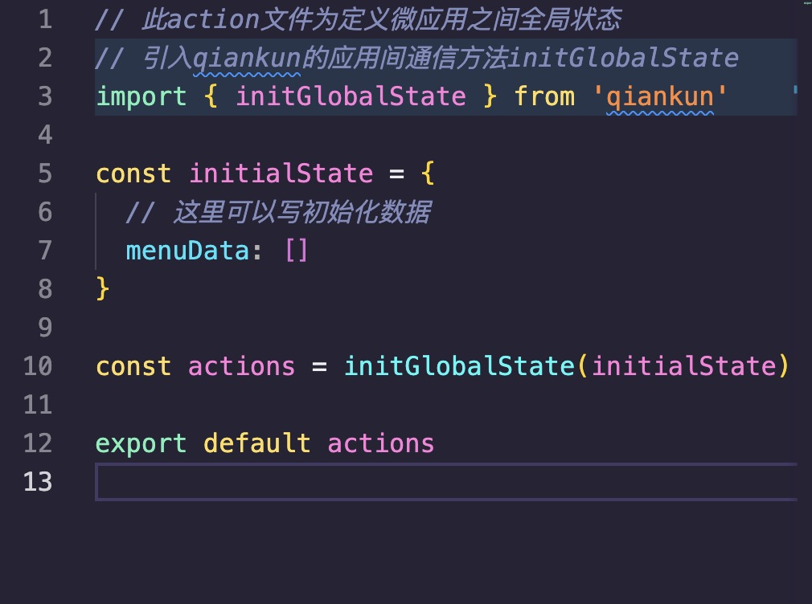
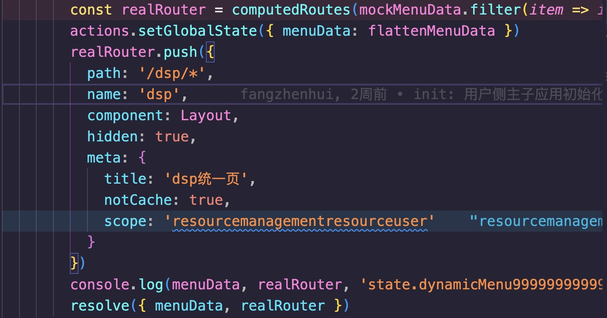
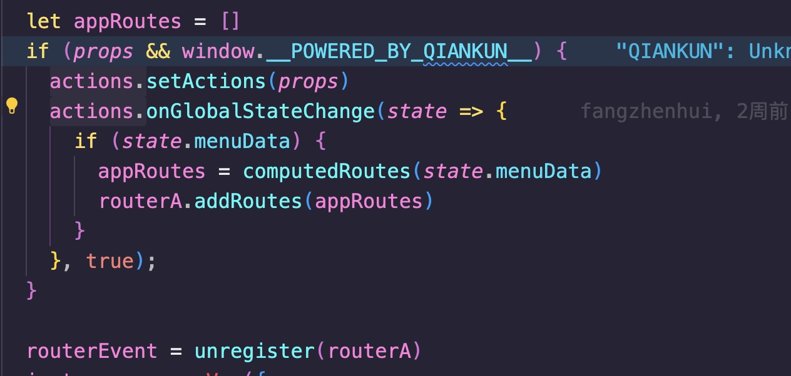
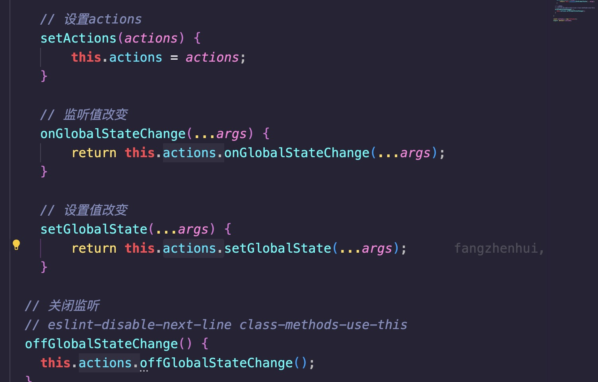
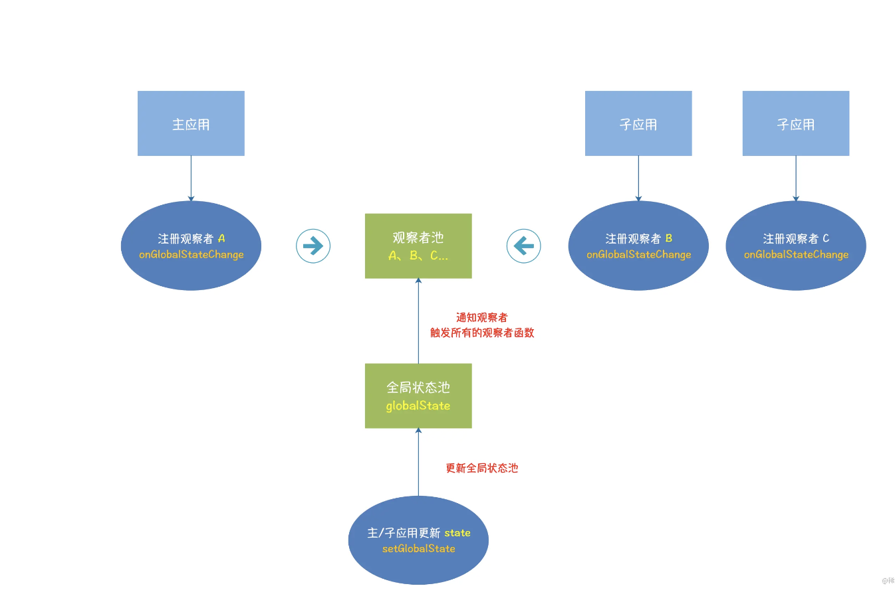
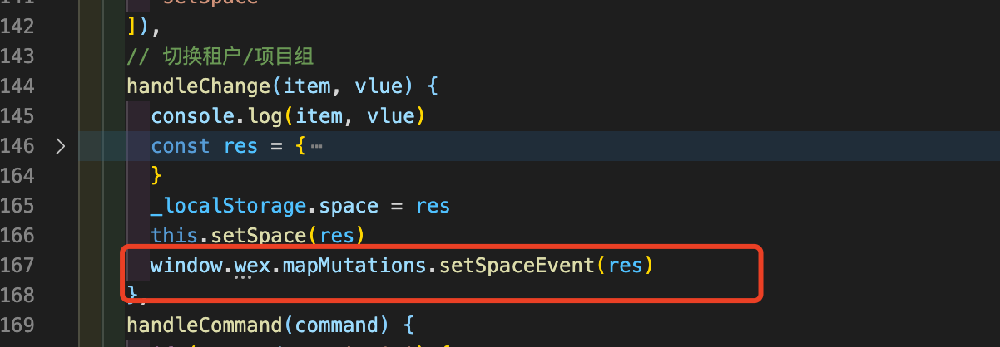
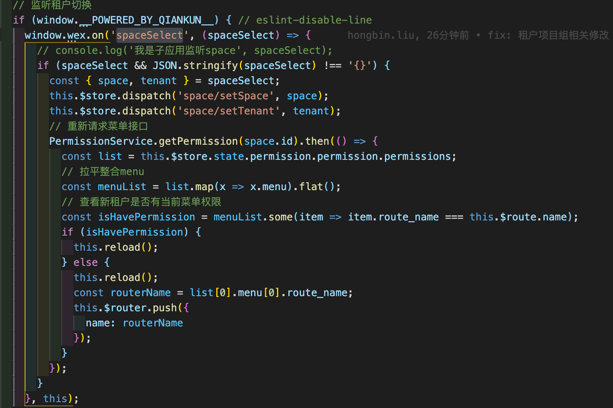

微前端是一种将前端应用程序拆分为多个小型独立部分的架构模式。在微前端架构中，不同的前端应用程序可以由不同的团队开发和维护，并且可以独立部署。应用程序之间的通信是微前端中一个重要的问题，以下是几种常见的微前端应用间通信方式

## 基于 URL 的通信

不同的微前端应用可以通过 URL 参数来传递信息，例如，一个微前端应用可以将信息编码到 URL 中，并将 URL 发送给另一个微前端应用。这种方式相对简单，但是只适用于传递较小的数据。

- 优点：实现简单，不需要中心化的消息传递系统，可用于传递少量的数据。

- 缺点：只适用于传递较小的数据，不适用于大量的数据或复杂的数据结构。URL 参数可能会暴露敏感信息，需要进行安全性考虑。

## Actions 通信

### 使用

qiankun 内部提供了 initGlobalState 方法

该实例有三个方法，分别是：

- setGlobalState：设置 globalState - 设置新的值时，内部将执行 浅检查，如果检查到 globalState 发生改变则触发通知，通知到所有的 观察者 函数。
  

- onGlobalStateChange：注册 观察者 函数 - 响应 globalState 变化，在 globalState 发生改变时触发该 观察者 函数。
  

- offGlobalStateChange：取消 观察者 函数 - 该实例不再响应 globalState 变化。
  

我们从上图可以看出，我们可以先注册 观察者 到观察者池中，然后通过修改 globalState 可以触发所有的 观察者 函数，从而达到组件间通信的效果。

### 优缺点

优点：

- 简单易用：Actions通信的API非常简单，只需要定义一个action并将其导出，其他微前端应用就可以通过调用该action来进行通信。

- 轻量级：Actions通信不需要中心化的消息传递系统或状态管理器，只需要在应用之间传递轻量级的JSON对象即可实现通信。

- 高效性：Actions通信使用了类似于事件总线的机制，能够快速地进行通信并处理大量的数据。

- 稳定性：Actions通信使用了发布/订阅的模式，可以保证在应用之间进行通信时不会出现数据丢失或者重复发送的问题。

缺点：

- 只能传递JSON对象：由于Actions通信只能传递JSON对象，不支持传递二进制数据或者复杂的数据结构，因此在一些情况下可能会存在一定的限制。

- 需要手动定义action：在使用Actions通信时，需要手动定义action并将其导出，这可能会增加代码的复杂度和维护成本。

- 不适用于高度耦合的应用：Actions通信适用于松散耦合的微前端应用，如果应用之间高度耦合，使用Actions通信可能会增加代码的复杂度和维护成本。

总的来说，Actions通信是一种简单、轻量级、高效和稳定的微前端应用间通信方式，适用于松散耦合的微前端应用。但是，由于其只能传递JSON对象和需要手动定义action等限制，需要根据具体的业务需求和技术情况选择合适的通信方式。

## Shared 通信

适用于需要频繁进行数据共享和同步的场景

## wex通信

示例: 主控台切换租户，通知其他子应用

Wex注册 src/store/wex.js

子应用监听

子应用卸载

## cookie数据共享

token之类的信息，一般存放在cookie中，请求中会带给后端
有同ip段的限制，之前东电就是这样实现的
大连是项目部署的时候，就部署在同一个文件下的，同一个访问地址

在实现微前端架构时，需要根据具体的业务需求和技术情况选择合适的通信方式。通信方式的选择应该考虑到数据的大小、数据结构的复杂度、系统的可扩展性和可靠性等因素。
