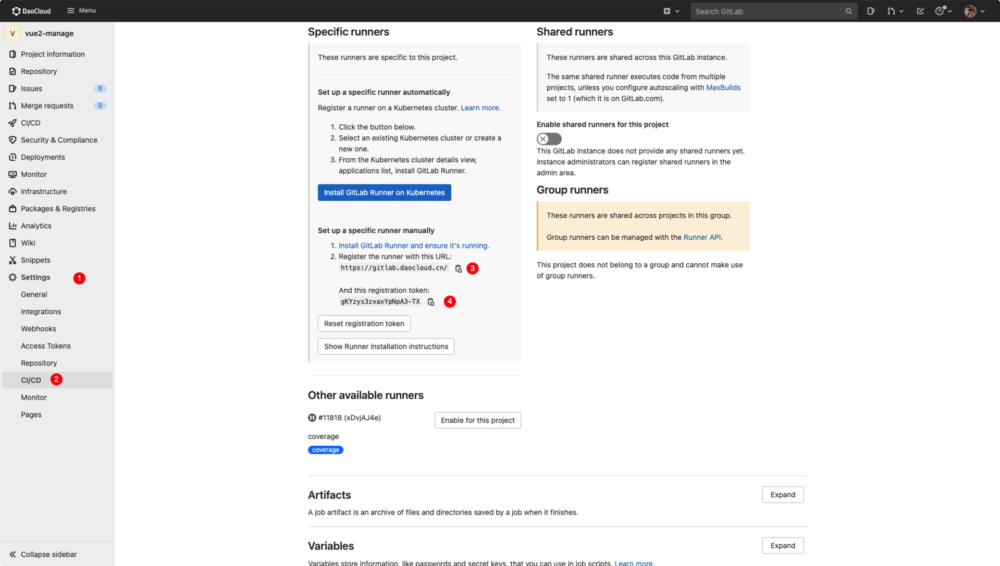
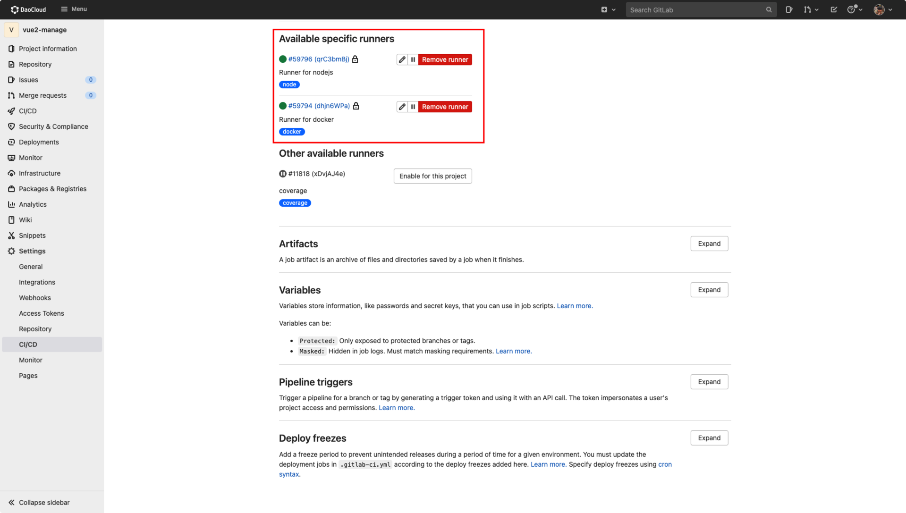
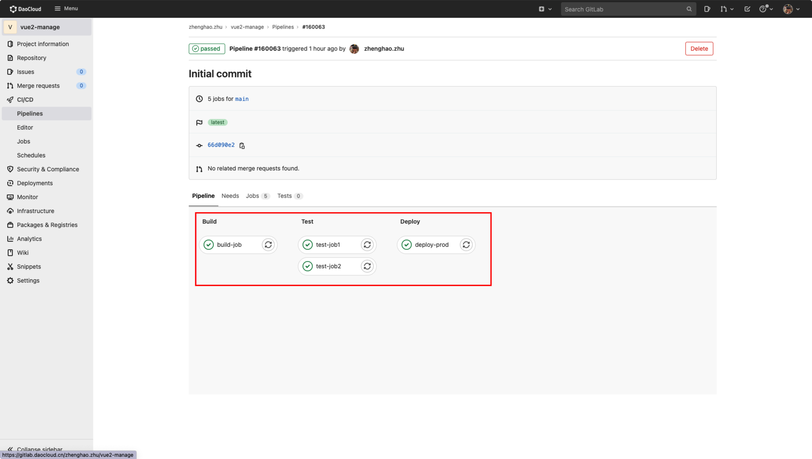

## 清单

## Gitlab Runner

### 安装

[Install GitLab Runner](https://docs.gitlab.com/runner/install/)

为了方便演示，我们使用
[homebrew](https://docs.gitlab.com/runner/install/osx.html#homebrew-installation-alternative)
在本地 Mac 上，安装 Gitlab Runner。

1. 安装 GitLab Runner

   ```shell
   brew install gitlab-runner
   ```

2. 以服务的方式启动 Gitlab Runner

   ```shell
   brew services start gitlab-runner
   ```

### 注册一个 runner

我们在 [macOS](https://docs.gitlab.com/runner/register/#macos) 上面注册一个 runner，用于自动化构建、测试、打包和部署你的应用程序。

1. 运行命令

   ```shell
   gitlab-runner register
   ```

2. 请输入您的 GitLab 实例 URL（也称为 gitlab-ci 协调器 URL）。

   

3. 输入您获取以注册 runner 的 token。
4. 为 runner 输入一个描述。您可以稍后在 GitLab 用户界面中更改此值。
5. 输入与 runner 关联的标签，用逗号分隔。您可以稍后在 GitLab 用户界面中更改此值。
6. 为 runner 输入任何可选的维护备注。
7. 提供 runner 执行器。对于大多数用例，请输入 docker。
8. 如果您将执行器设置为 docker，则会要求您提供在 .gitlab-ci.yml 中未定义默认镜像的项目要使用的默认镜像。

```shell
sudo gitlab-runner register \
  --tag-list node \
  --url https://gitlab.daocloud.cn/ \
  --registration-token Y7RR-LJGyzVxhwuAf241 \
  --executor docker \
  --docker-image "release.daocloud.io/dpo-ui/node" \
  --description "Runner for nodejs"
```

```shell
sudo gitlab-runner register \
  --tag-list docker \
  --url https://gitlab.daocloud.cn/ \
  --registration-token Y7RR-LJGyzVxhwuAf241 \
  --executor docker \
  --docker-image "release.daocloud.io/dpo-ui/docker" \
  --docker-privileged \
  --docker-volumes /var/run/docker.sock:/var/run/docker.sock \
  --description "Runner for docker"
```

### 确认 Runner 可用

- Settings > CI/CD，展开 Runners。

  

## 创建 `.gitlab-ci.yml`

在项目的根目录执行：

```shell
cat > .gitlab-ci.yml << EOF
build-job:
  stage: build
  script:
    - echo "Hello, $GITLAB_USER_LOGIN!"

test-job1:
  stage: test
  script:
    - echo "This job tests something"

test-job2:
  stage: test
  script:
    - echo "This job tests something, but takes more time than test-job1."
    - echo "After the echo commands complete, it runs the sleep command for 20 seconds"
    - echo "which simulates a test that runs 20 seconds longer than test-job1"
    - sleep 20

deploy-prod:
  stage: deploy
  script:
    - echo "This job deploys something from the \$CI_COMMIT_BRANCH branch."
EOF
```

> Note: 设置默认的 runner

### 查看 pipeline 和 job 的状态

- CI/CD > Pipelines



### 配置 .gitlab-ci.yml

[.gitlab-ci.yml 关键字参考](https://docs.gitlab.cn/jh/ci/yaml/)

#### stages

使用 `stages` 来定义包含作业组的阶段。`stages` 是为流水线全局定义的。在作业中使用 `stage` 来定义作业属于哪个阶段。

如果 `.gitlab-ci.yml` 文件中没有定义 `stages`，那么默认的流水线阶段是：

- `.pre`
- `build`
- `test`
- `deploy`
- `.post`

`stages` 项的顺序定义了作业的执行顺序：

- 同一阶段的作业并行运行。
- 下一阶段的作业在上一阶段的作业成功完成后运行。

#### workflow

使用 `workflow`: 来确定是否创建流水线。 在顶层定义此关键字，使用单个 `rules:` 关键字，类似于在作业中定义的 `rules:`。

#### workflow:rules

您可以使用 `workflow:rules` 模板 导入预先配置的 `workflow:rules` 条目。

`workflow: rules` 接受这些关键字：

- `if`：检查此规则以确定何时运行流水线。
- `when`：指定当 if 规则为 `true` 时要做什么。
  - 要运行流水线，请设置为 `always`。
  - 要阻止流水线运行，请设置为 `never`。
- `variables`：如果未定义，则使用在别处定义的变量。

### Job

`image`
:使用 `image` 指定运行作业的 `Docker` 镜像。

`script`
:使用 `script` 指定 `runner` 要执行的命令。

```shell
job1:
  script: "bundle exec rspec"

job2:
  script:
    - uname -a
    - bundle exec rspec
```

`before_script`
:使用 `before_script` 来定义一系列命令，这些命令应该在每个作业的 `script` 命令之前运行，但在 `artifacts` 恢复之后。

```shell
job:
  before_script:
    - echo "Execute this command before any 'script:' commands."
  script:
    - echo "This command executes after the job's 'before_script' commands."
```

`after_script`
:使用 `after_script` 定义在每个作业之后运行的命令数组，包括失败的作业。

```shell
job:
  script:
    - echo "An example script section."
  after_script:
    - echo "Execute this command after the `script` section completes."
```

`stage`
:使用 `stage` 定义作业在哪个 `stage` 中运行。同一个 `stage` 中的作业可以并行执行。

如果没有定义 `stage`，则作业默认使用 `test` 阶段。

`rules`
:使用 rules 来包含或排除流水线中的作业。

`needs`
:使用 `needs`: 来不按顺序执行作业。使用 `needs` 的作业之间的关系可以可视化为有向无环图。

您可以忽略阶段排序并运行一些作业，而无需等待其他作业完成。 多个阶段的作业可以同时运行。

`tags`
:使用 `tags` 从项目可用的所有 `runner` 列表中选择一个特定的 `runner`。

注册 `runner` 时，您可以指定 `runner` 的标签，例如 `ruby`、`postgres` 或 `development`。
要获取并运行作业，必须为 `runner` 分配作业中列出的每个标签。

`allow_failure`
:使用 `allow_failure` 来确定当作业失败时，流水线是否应该继续运行。

要让流水线继续运行后续作业，请使用 `allow_failure: true`。
要停止流水线运行后续作业，请使用 `allow_failure: false`。

`when`
:使用 `when` 配置作业运行的条件。如果未在作业中定义，则默认值为 `when: on_success`。

可能的输入：

- `on_success`（默认）：仅当早期阶段的所有作业都成功或具有 `allow_failure: true` 时才运行作业。
- `manual`：仅在手动触发时运行作业。
- `always`：无论早期阶段的作业状态如何，都运行作业。也可以在 `workflow:rules` 中使用。
- `on_failure`：只有在早期阶段至少有一个作业失败时才运行作业。带有 `allow_failure: true` 的作业总是被认为是成功的。
- `delayed`：作业的执行延迟指定的持续时间。
- `never`：不要运行作业。只能在 `rules` 部分或 `workflow: rules` 中使用。

```shell
stages:
  - build
  - cleanup_build
  - test
  - deploy
  - cleanup

build_job:
  stage: build
  script:
    - make build

cleanup_build_job:
  stage: cleanup_build
  script:
    - cleanup build when failed
  when: on_failure

test_job:
  stage: test
  script:
    - make test

deploy_job:
  stage: deploy
  script:
    - make deploy
  when: manual
  environment: production

cleanup_job:
  stage: cleanup
  script:
    - cleanup after jobs
  when: always
```

在这个例子中，脚本：

只有当 `build_job` 失败时才执行 `cleanup_build_job`。
无论成功或失败，始终将 `cleanup_job` 作为流水线的最后一步执行。
在 GitLab UI 中手动运行时执行 `deploy_job`。

`dependencies`
:使用 `dependencies` 关键字定义要从中获取产物的作业列表。 您还可以设置一个作业以完全不下载任何产物。

如果您不使用 `dependencies`，则前一阶段的所有产物都会传递给每个作业。

```shell
build osx:
  stage: build
  script: make build:osx
  artifacts:
    paths:
      - binaries/

build linux:
  stage: build
  script: make build:linux
  artifacts:
    paths:
      - binaries/

test osx:
  stage: test
  script: make test:osx
  dependencies:
    - build:osx

test linux:
  stage: test
  script: make test:linux
  dependencies:
    - build:linux

deploy:
  stage: deploy
  script: make deploy
  environment: production
```

在这个例子中，两个作业有产物：`build osx` 和 `build linux`。当执行 `test osx` 时，`build osx` 的产物被下载并在构建的上下文中提取。 同样的事情发生在 `test linux` 和 `build linux` 的产物上。

由于 `stage` 优先级，`deploy` 作业从所有以前的作业下载产物。

`artifacts`
:使用 artifacts 指定在作业 succeeds, fails, 或 always 时附加到作业的文件和目录列表。

作业完成后，产物将发送到 GitLab。如果大小不大于最大产物大小，它们可以在 GitLab UI 中下载。

默认情况下，后期的作业会自动下载早期作业创建的所有产物。您可以使用 dependencies 控制作业中的产物下载行为。

使用 needs 关键字时，作业只能从 needs 配置中定义的作业下载产物。

默认只收集成功作业的作业产物，产物在缓存后恢复。

### CI/CD Demo

[CI/CD templates](https://gitlab.daocloud.cn/help/ci/examples/index.md)
